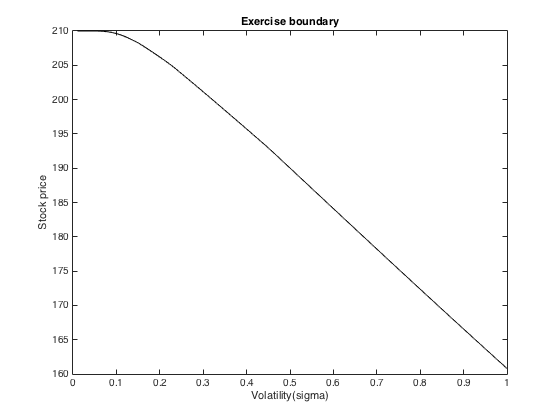

[](http://quantlet.de/)

## [](http://quantlet.de/) **SFEBoundary_V** [](http://quantlet.de/)

```yaml

Name of Quantlet : SFEBoundary_V

Published in : Statistics of Financial Markets I

Description : 'Computes the optimal exercise boundary problem of American put option using a
binomial tree under different volatilities.'

Keywords : Black Scholes, Binomial tree, boundary condition, geometric Brownian Motion

Author : Yaojun Liu, Yinan Wu

Submitted : 2015/12/28

-s0 : Stock Price

-k : Exercise Price

-i : Interest Rate

-sig : Volatility

-t : Time to Expiration

-n : Number of Intervals

Output : binomial trees and boundary figure

```




### MATLAB Code:
```matlab
% ---------------------------------------------------------------------
% Quantlet:     SFEBoundary_V
% ---------------------------------------------------------------------
% Description:  SFEBoundary_V computes the optimal exercise boundary problem 
%               of American put option using a binomial tree under 
%               different volatility.
% ---------------------------------------------------------------------
% Inputs:       s0 - Stock Price
%               k - Exercise Price
%               i - Interest Rate
%               sig - Volatility
%               t - Time to Expiration
%               n - Number of Intervals
% ---------------------------------------------------------------------
% Output:       binomial trees and boundary figure
% ---------------------------------------------------------------------
% Author:       Yaojun Liu, Yinan Wu 20151228
% ---------------------------------------------------------------------
clear,clc;clear all;
%% User inputs parameters
disp('Please input Price of Underlying Asset s0, Exercise Price k, Domestic Interest Rate per Year i');
disp('Time to Expiration (Years) t, Number of steps n');
disp('as: [230, 210, 0.04545,0.5, 50]');
disp(' ') ;
para=input('[s0, k, i, t, n]=');
while length(para) < 5
    disp('Not enough input arguments. Please input in 1*5 vector form like [230, 210, 0.04545, 0.25, 0.5, 50]');
    disp(' ') ;
    para=input('[s0, k, i, t, n]=');
end
s0=para(1);             % Stock price
k=para(2);              % Exercise price
i=para(3);              % Interest rate
t=para(4);         	    % Time to expiration
n=para(5);              % Number of intervals
sig=0.01:0.01:1;        % Volatility sigma
%Check conditions
if s0<=0
    disp('SFEBiTree: Price of Underlying Asset should be positive! Please input again')
    s0=input('s0=');
end
if k<0
    disp('SFEBiTree: Exercise price couldnot be negative! Please input again')
    k=input('k=');
end
if t<=0
    disp('SFEBiTree: Time to expiration should be positive! Please input again')
    t=input('t=');
end
if n<1
    disp('SFEBiTree: Number of steps should be at least equal to 1! Please input again')
    n=input('n=');
end
%% Main computation
boundary=zeros(length(sig),1);
for o=1:length(sig);                                % Different volatility
    dt=t/n;                                         % Interval of step
    u(o)=exp(sig(o)*sqrt(dt));                      % Up movement parameter u
    d(o)=1/u(o);                                    % Down movement parameter d
    b=i;                                            % Costs of carry
    p(o)=0.5+0.5*(b-sig(o)^2/2)*sqrt(dt)/sig(o);    % Probability of up movement
    % Pricing the option under different volatility
    s=ones(n+1,n+1)*s0;
    un=zeros(n+1,1);
    un(n+1,1)=1;
    dm=un';
    um=[];
    j=1;
    l=1;
    while j<n+1
        d1=[zeros(1,n-j) (ones(1,j+1)*d(o)).^((1:j+1)-1)];
        dm=[dm; d1];                                       % Down movement dynamics
        u1=[ones(1,n-j)-1 (ones(1,j+1)*u(o)).^((j:-1:0))];
        um=[um; u1];                                       % Up movement dynamics
        j=j+1;
    end
    um=[un';um]';
    dm=dm';
    s=s(1,1).*um.*dm;                                  % Stock price development
    Stock_Price=s;
    s=flipud(s);                                       % Rearangement
    opt = zeros(size(s));
    %% Option is an american put
    opt(:,n+1) = max(k-s(:,n+1),0);                    % Determine option values from prices
    for j = n:-1:1
        l = 1:j;
        % Probable option values discounted back one time step
        discopt = ((1-p(o))*opt(l,j+1)+p(o)*opt(l+1,j+1))*exp(-b*dt);
        % Option value is max of X - current price or discopt
        opt(:,j) = [max(k-s(1:j,j),discopt);zeros(n+1-j,1)];
    end
    American_Put_Price = flipud(opt);
    boundary(o)=k-American_Put_Price(end,1);           % Boundary price with different volatility
end
%% Figures of boundary price under different volatility
plot(sig,boundary,'k-')
title('Exercise boundary')
xlabel('Volatility(sigma)')
ylabel('Stock price')


```
