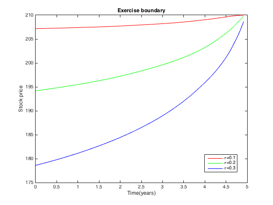

[](http://quantlet.de/)

## [](http://quantlet.de/) **SFEBoundary_V_tau** [](http://quantlet.de/)

```yaml

Name of Quantlet : SFEBoundary_V_tau

Published in : Statistics of Financial Markets I

Description : 'Computes the optimal exercise boundary problem of American put option with different
volatility for assets without dividends'

Keywords : Black Scholes, Binomial tree, boundary condition, geometric Brownian Motion

Author : Yaojun Liu, Yinan Wu

Submitted : 2015/12/28

Input: 
- s0: Stock Price
- k: Exercise Price
- i: Interest Rate
- sig: Volatility
- t: Time to Expiration
- n: Number of Intervals

Output : Boundary figures with different volatilities

```




### MATLAB Code:
```matlab
% ---------------------------------------------------------------------
% Quantlet:     SFEBoundary_V_tau
% ---------------------------------------------------------------------
% Description:  SFEBoundary_V_tau computes the optimal exercise boundary problem 
%               of American put option with different volatility for 
%               assets without dividends.
% ---------------------------------------------------------------------
% Inputs:       s0 - Stock Price
%               k - Exercise Price
%               i - Interest Rate
%               sig - Volatility
%               t - Time to Expiration
%               n - Number of Intervals
% ---------------------------------------------------------------------
% Output:       Boundary figures with different volatility
% ---------------------------------------------------------------------
% Author:       Yaojun Liu, Yinan Wu 20151228
% ---------------------------------------------------------------------
clear,clc;clear all;
%% user inputs parameters
disp('Please input Price of Underlying Asset s0, Exercise Price k, Domestic Interest Rate per Year i');
disp('Number of steps n');
disp('as: [230, 210, 0.04545, 50]');
disp(' ') ;
para=input('[s0, k, i, n]=');
while length(para) < 4
    disp('Not enough input arguments. Please input in 1*5 vector form like [230, 210, 0.04545, 0.25, 0.5, 50]');
    disp(' ') ;
    para=input('[s0, k, i, n]=');
end
s0=para(1);             % Stock price
k=para(2);              % Exercise price
i=para(3);              % Interest rate
n=para(4);              % Number of intervals
tau=1/12:1/12:5;        % Time to maturity
sig=0.1:0.1:0.3;        % Volatility
%Check conditions
if s0<=0
    disp('SFEBiTree: Price of Underlying Asset should be positive! Please input again')
    s0=input('s0=');
end
if k<0
    disp('SFEBiTree: Exercise price couldnot be negative! Please input again')
    k=input('k=');
end
if n<1
    disp('SFEBiTree: Number of steps should be at least equal to 1! Please input again')
    n=input('n=');
end
%% main computation
boundary_sig=zeros(length(tau),length(sig));
for w=1:length(sig)
    boundary=zeros(length(tau),1);
    for o=1:length(tau);
        dt(o)=tau(o)/n;                                    % Interval of step
        u(o)=exp(sig(w)*sqrt(dt(o)));                      % Up movement parameter u
        d(o)=1/u(o);                                       % Down movement parameter d
        b=i;                                               % Costs of carry
        p(o)=0.5+0.5*(b-sig(w)^2/2)*sqrt(dt(o))/sig(w);    % Probability of up movement
        % Pricing with different volatility and time to maturity
        s=ones(n+1,n+1)*s0;
        un=zeros(n+1,1);
        un(n+1,1)=1;
        dm=un';
        um=[];
        j=1;
        l=1;
        while j<n+1
            d1=[zeros(1,n-j) (ones(1,j+1)*d(o)).^((1:j+1)-1)];
            dm=[dm; d1];                                       % Down movement dynamics
            u1=[ones(1,n-j)-1 (ones(1,j+1)*u(o)).^((j:-1:0))];
            um=[um; u1];                                       % Up movement dynamics
            j=j+1;
        end
        um=[un';um]';
        dm=dm';
        s=s(1,1).*um.*dm;                                      % Stock price development
        Stock_Price=s;
        s=flipud(s);                                           % Rearangement
        opt = zeros(size(s));
        % Option is an american put
        opt(:,n+1) = max(k-s(:,n+1),0);               % Determine option values from prices
        for j = n:-1:1
            l = 1:j;
            % Probable option values discounted back one time step
            discopt = ((1-p(o))*opt(l,j+1)+p(o)*opt(l+1,j+1))*exp(-b*dt(o));
            % Option value is max of X - current price or discopt
            opt(:,j) = [max(k-s(1:j,j),discopt);zeros(n+1-j,1)];
        end
        American_Put_Price = flipud(opt);
        boundary(o)=k-American_Put_Price(end,1);
    end
    boundary_sig(:,w)=boundary;
end
t=5-tau;
%% The figures of boundary price with different volatility 
plot(t,boundary_sig(:,1),'r-') 
hold on
plot(t,boundary_sig(:,2),'g-')
hold on
plot(t,boundary_sig(:,3),'b-')
legend('\sigma=0.1','\sigma=0.2','\sigma=0.3')
hold on
title('Exercise boundary')
xlabel('Time(years)')
ylabel('Stock price')


```
