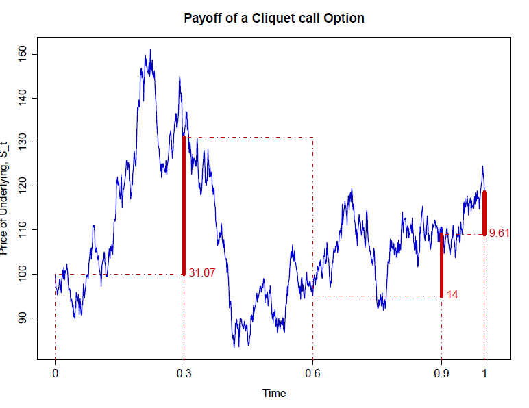
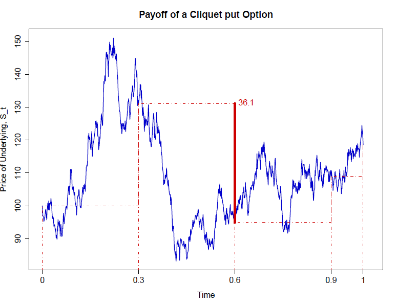

[](http://quantlet.de/index.php?p=info)

## [](http://quantlet.de/) **SFECliquetPayoff** [](http://quantlet.de/d3/ia)

```yaml

Name of Quantlet : SFECliquetPayoff

Published in : Statistics of Financial Markets I

Description : 'Calculates and plot the payoff of a cliquet put/call option. When there is no reset
points this will generate the pay off graph of a European put/call option.'

Keywords : plot, option, call, put, exotic-option, european-option

See also : SFECliquetPrice

Author : Weongi Woo, Thorsten Disser

Submitted : 2015/12/20

Input: 
- S0: Stock price at t = 0
- r: Risk free interest rate
- D: Continuous dividend payment
- sigma: Volatility
- reset: Reset points
- typ: The type of options to plot. "call" and "put" are available.

Output : 'A plot of simulated underlying with the payoff of the desired option type considered at
the desired resets.'

Example : 'Plots are generated for the following parameter values: S0 = 100, r = 0.3, D = 0.01,
sigma = 0.5, reset = c(0.3, 0.6, 0.9), typ = "call"'

```






```r
#------------------------------------------------------------------------
# Book:         SFE4
# -----------------------------------------------------------------------
# Quantlet:     SFECliquetPayoff
# -----------------------------------------------------------------------
# Description:  SFECliquetPayoff calculates and plot the payoff of a
#               cliquet put/call option. When there is no reset points
#               this will generate the pay off graph of a European
#               put/call option.
#------------------------------------------------------------------------
# Usage:        -
#------------------------------------------------------------------------
#See also:      SFECliquetPrices
#------------------------------------------------------------------------
# Keywords:     plot, option, call, put, exotic-option, european-option
#------------------------------------------------------------------------
# Inputs:       S0, r, D, sigma, reset, typ
#------------------------------------------------------------------------
# Output:       A plot of simulated underlying with the payoff of the 
#               desired option type considered at the desired resets.
# -----------------------------------------------------------------------
# Example:      Plots are generated for the following parameter values:
#               S0 = 100, r = 0.3, D = 0.01, sigma = 0.5, 
#               reset = c(0.3, 0.6, 0.9), typ = "call"
#------------------------------------------------------------------------
# Author:       Weongi Woo, Thorsten Disser, 2015/12/20
#------------------------------------------------------------------------
########################################################################
# clear variables and close windows
rm(list = ls(all = TRUE))
graphics.off()

# Parameter Setting
S0    = 100                   # stock price at t = 0
K1    = S0
r     = 0.03                   # risk free interest rate
D     = 0.01                   # continuous dividend payment
b     = r - D                  # cost of carry
sigma = 0.5                # volatility
reset = c(0.3, 0.6, 0.9)   # c(0) for a European Option
typ   = "call"               # the possible alternative is "put"


########################################################################
# Simulating Underlying Price
Tn  = 1000
t   = (1:Tn)/Tn
dt  = t[2] - t[1]
Wt1 = rnorm(length(t), mean = 0, sd = 1)
Wt  = cumsum(Wt1)  # cumulative sum
St  = S0 * exp((r - 0.5 * sigma) * dt + sigma * sqrt(dt) * Wt)


########################################################################
# adding time 0 and 1
if (reset[1] != 0) {
    reset <- c(0, reset)
}

if (reset[length(reset)] != 1) {
    reset[length(reset) + 1] = 1
}

# Generating Strike Prices
for (i in 2:length(reset)) {
    assign(paste("K", i, sep = ""), St[(reset[i]) * 1000])
}
if (typ == "call") {
    for (i in 1:(length(reset) - 1)) {
        assign(paste("period", i, sep = ""), St[(reset[i + 1]) * 1000] - get(paste("K", i, sep = "")))
    }
} else {
    for (i in 1:(length(reset) - 1)) {
        assign(paste("period", i, sep = ""), get(paste("K", i, sep = "")) - St[(reset[i + 1]) * 1000])
    }
}

########################################################################
# Generating Plots 
#par(mar=c(2,4,4,9), xpd=FALSE)
par(mfrow = c(1, 1))
plot(c(0, t), c(S0, St), type = "l", col = "blue3", xlab = "Time", ylab = "Price of Underlying, S_t", xaxt = "n", lwd = 2, xlim = c(0, 1.04))
if (length(reset) == 2) {
    title(paste("Payoff of a European ", typ, " Option", sep = ""))
} else {
    title(paste("Payoff of a Cliquet ", typ, " Option", sep = ""))
}

axis(1, at = c(reset), label = c(reset))

for (i in 1:length(reset)) {
    lines(c(reset[i], reset[i]), c(0, get(paste("K", i, sep = ""))), lwd = 2, lty = "dotdash", col = "red3")
}

for (i in 1:(length(reset) - 1)) {
    lines(c(reset[i], reset[i + 1]), c(get(paste("K", i, sep = "")), get(paste("K", i, sep = ""))), lwd = 2, lty = "dotdash", col = "red3")
    if (get(paste("period", i, sep = "")) > 0) {
        lines(c(reset[i + 1], reset[i + 1]), c(get(paste("K", i, sep = "")), get(paste("K", i + 1, sep = ""))), lwd = 6, lty = "solid", col = "red3")
        text(reset[i + 1], get(paste("K", i, sep = "")), label = round(get(paste("period", i, sep = "")), digits = 2), pos = 4, cex = 1, col = "red3")
    } else {
        lines(c(reset[i + 1], reset[i + 1]), c(get(paste("K", i, sep = "")), get(paste("K", i + 1, sep = ""))), lwd = 2, lty = "dotdash", col = "red3")
    }
}

# legend par(fig=c(0, 1, 0, 1), oma=c(0, 0, 0, 0), mar=c(0, 0, 1, 1), new=TRUE) plot(0, 0, type='n', bty='n', xaxt='n', yaxt='n') legend('topright', c('St','B'),
# lty=c('solid','dotted'), seg.len=c(1,1), lwd=2, col=c('blue3','red3'), cex=0.7)

```
