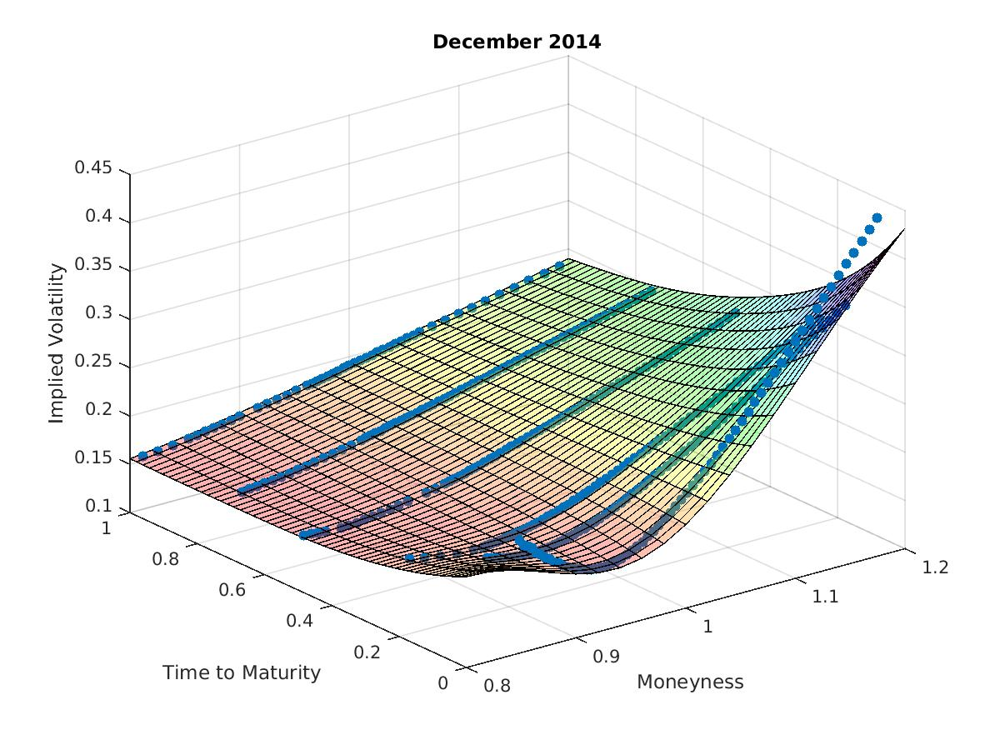

[](http://quantlet.de/index.php?p=info)

## [](http://quantlet.de/) **SFEVolSurfPlot** [](http://quantlet.de/d3/ia)

```yaml

Name of QuantLet : SFEVolSurfPlot

Published in : Statistics of Financial Markets I

Description : 'Produces a graphic visualisation of the implied volatility surface. The implied
volatility smiles are shown as blue scatter plot.'

Keywords : Black Scholes, implied volatility, volatility

See also : SFEVolaTermStructure, SFEVolaCov, SFEVolaPCA, SFEPCA, SFEVolSurfMovie

Author : Maria Grith

Author[Update] : Sabine Bertram, Steffen Thesdorf

Datafile : surf_1412.csv

Input : 'Price of the option, skrike price, risk-free interest rate, time to maturity, price of the
underlying and Put-Call-flag'

Output : Plot of implied volatility surface

```




```matlab
%%
%--------------------------------------------------------------------------
% Data Preparation
%--------------------------------------------------------------------------

clear all
clc
close all

% read the data
x=csvread('surf_1412.csv');

% calculate moneyness
x(:,7)=x(:,1)./x(:,2);

% exclude date with time to maturity>1, moneyness<0.7 as well as >1.2
ex1=find(x(:,4)>1);
ex2=find(x(:,7)<0.8 |x(:,7)>1.2);
ex=[ex1;ex2];
x(ex,:)=[];

% assign vectors
Price=x(:,1);       
Strike=x(:,2);      
Rate=x(:,3);
Time=x(:,4);
Value=x(:,5);
Class=x(:,6);

% calculate the IV with the Black-Scholes-Formula
iv = blsimpv(Price, Strike, Rate, Time, Value,[],[], [],Class);
x(:,8)=iv;

% exclude missing values
ex3=find(isnan(iv));
x(ex3,:)=[];

%%

%--------------------------------------------------------------------------
% Grid Preparations
%--------------------------------------------------------------------------

% set bounderies for moneyness and maturity
firstmon=0.8;
lastmon=1.2;
firstmat=0;
lastmat=1;

% set spaces in grid: moneyness in steps of 0.02, maturity in steps of 1 week
stepwidth=[0.02 1/52];
lengthmon=ceil((lastmon-firstmon)/stepwidth(1));
lengthmat=ceil((lastmat-firstmat)/stepwidth(2));

mongrid=linspace(0.8,1.2,lengthmon+1);
matgrid=linspace(0,1,lengthmat+1);

[MON, MAT]=meshgrid(mongrid,matgrid);

%%
%--------------------------------------------------------------------------
% Smoothing the Surface with the Nadaraya-Watson-Kernel Estimation
%--------------------------------------------------------------------------

gmon=lengthmon+1;
gmat=lengthmat+1;
uu=size(x);
v=uu(1,1);
ivsurf=zeros(gmat,gmon);

j=1;
while (j<gmat+1);
    k=1;
    while (k<gmon+1);
        i=1;

        % regression matrix
        X=zeros(v,3);
        while (i<v+1);
            X(i,:)=[1,x(i,7)-MON(j,k), x(i,4)-MAT(j,k)];
            i=i+1;
        end

        % implied volatility
        Y=x(:,8);

        % optimal bandwidth by Silverman's rule of thumb
        a=unique(x(:,7));
        h1=0.9*min(std(a),iqr(a)/1.34)*length(a)^(-1/5);

        b=unique(x(:,4));
        h2=0.9*min(std(b),iqr(b)/1.34)*length(b)^(-1/5);

        % kernel matrix - gaussian kernel
        W=zeros(v,v);
        i=1;
        while (i<v+1);
            u1=(x(i,7)-MON(j,k))/h1;
            u2=(x(i,4)-MAT(j,k))/h2;
            aa=sqrt(1/2*pi)*exp(-0.5*u1^2);
            bb=sqrt(1/2*pi)*exp(-0.5*u2^2);
            W(i,i)=aa*bb;
            i=i+1;
        end

        % Nadaraya Watson kernel estimation
        est=inv(X'*W*X)*X'*W*Y;
        ivsurf(j,k)=est(1);
        k=k+1;
    end
    j=j+1;
end

% surface
IV=ivsurf;
%%
%--------------------------------------------------------------------------
% Plot surface and save 
%--------------------------------------------------------------------------

% plot surface
surf(MON,MAT,IV)
colormap hsv
alpha(0.3) 

% scatter iv's for single time to maturities
hold on
Time=x(:,4);
Moneyness=x(:,7);
iv=x(:,8);
scatter3(Moneyness,Time,iv,'filled')

% label axis
xlabel('Moneyness')
ylabel('Time to Maturity')
zlabel('Implied Volatility')

% title plot
Title={'December 2014'};
title(Title)

hold off

% save figure
saveas(gcf, sprintf('VolSurfPlot.jpg'))

```
