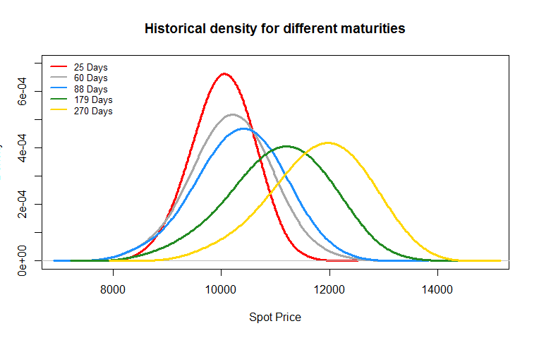
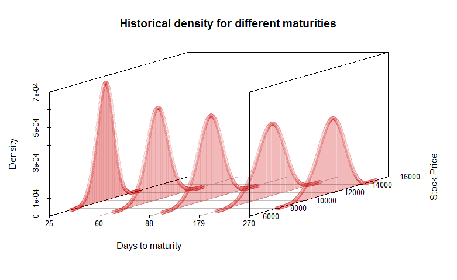
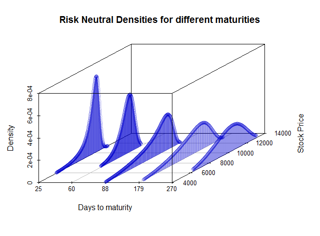

[](http://quantlet.de/index.php?p=info)

## [](http://quantlet.de/) **SFE_RND_HD** [](http://quantlet.de/d3/ia)

```yaml
Name of Quantlet: SFE_RND_HD

Published in: Statistics of Financial Markets I

Description: 'SFE_RND_HD estimates the risk neutral and historical Density for option data (traded
on the 22nd of December 2014) and historical index of the DAX.  The RND is estimated by the Rookley
method and the historical density (HD) by kernel density estimation. The results are plots
corresponding to the expiration date of the options where the RND and HD.'

Keywords: 'kernel, Black Scholes, Breeden and Litzenberger, nonparametric, option price, density,
State-Price Density, Rookley, historical density'

See also: XFGSPDcb, XFGSPDcb2, COPdensitydaxreturn

Author: Sophie Stadlinger, Karolina Stanczak

Submitted: 2015/12/11

Datafile: odata.txt, DAX30.csv

Input: 'Historical time series of the DAX Index price, option price, strike price, risk free
interest rate, time to maturity, DAX Index price.'

Output: 'Densities for different times to maturity and the corrsponding plots.'
```







```r

# clear all variables
rm(list = ls(all = TRUE))
graphics.off()

# install and load packages
libraries = c("KernSmooth", "matlab", "kedd", "scatterplot3d", "scales")
lapply(libraries, function(x) if (!(x %in% installed.packages())) {
  install.packages(x)
})
lapply(libraries, library, quietly = TRUE, character.only = TRUE)

# ---------------------------------------------------------------------------#
# Data preparation                                                           #
# ---------------------------------------------------------------------------#

# Read data
odata       = read.table("odata.txt", header = T, sep = "\t", dec = ".")  # option data
idata       = read.csv("DAX30.csv", header = T, sep = ",")  # index data
idata$Date  = as.Date(idata$Date, format = "%Y-%m-%d")
dax         = data.frame(idata$Date, idata$Adj.Close)
names(dax)  = c("Date", "DAX")

# Select data for the chosen time to maturity
odax = subset(odata, odata$maturity < 0.75)

# ---------------------------------------------------------------------------#
# Function for estimation of state price densities (risk neutral densities)  #
# ---------------------------------------------------------------------------#

# Result of Breeden and Litzenberger (1978) is needed spdbl uses the
# Breeden and Litzenberger (1978) method and a semiparametric
# specification of the Black-Scholes option pricing function to
# calculate the empirical State Price Density. The analytic formula
# uses an estimate of the volatility smile and its first and second
# derivative to calculate the State-price density. This method can only
# be applied to European options (due to the assumptions).

spdbl = function(m, sigma, sigma1, sigma2, s, r, tau) {
  rm  = length(m)
  st  = sqrt(tau)
  ert = exp(r * tau)
  rt  = r * tau
  
  # Modified Black-Scholes scaled by S-div instead of F
  d1 = (log(m) + tau * (r + 0.5 * (sigma^2)))/(sigma * st)
  d2 = d1 - sigma * st
  
  f = pnorm(d1, mean = 0, sd = 1) - pnorm(d2, mean = 0, sd = 1)/(ert * m)
  
  # First derivative of d1 term
  d11 = (1/(m * sigma * st)) - (1/(st * (sigma^2))) * ((log(m) + tau * 
    r) * sigma1) + 0.5 * st * sigma1
  
  # First derivative of d2 term
  d21 = d11 - st * sigma1
  
  # Second derivative of d1 term
  d12 = -(1/(st * (m^2) * sigma)) - sigma1/(st * m * (sigma^2)) + sigma2 * 
    (0.5 * st - (log(m) + rt)/(st * (sigma^2))) + sigma1 * (2 * sigma1 * 
    (log(m) + rt)/(st * sigma^3) - 1/(st * m * sigma^2))
  
  # Second derivative of d2 term
  d22 = d12 - st * sigma2
  
  # Please refer to either Rookley (1997) or the XploRe Finance Guide for
  # derivations
  f1 = dnorm(d1, mean = 0, sd = 1) * d11 + (1/ert) * ((-dnorm(d2, mean = 0, 
    sd = 1) * d21)/m + pnorm(d2, mean = 0, sd = 1)/(m^2))
  f2 = dnorm(d1, mean = 0, sd = 1) * d12 - d1 * dnorm(d1, mean = 0, sd = 1) * 
    (d11^2) - (1/(ert * m) * dnorm(d2, mean = 0, sd = 1) * d22) + ((dnorm(d2, 
    mean = 0, sd = 1) * d21)/(ert * m^2)) + (1/(ert * m) * d2 * dnorm(d2, 
    mean = 0, sd = 1) * (d21^2)) - (2 * pnorm(d2, mean = 0, sd = 1)/(ert * 
    (m^3))) + (1/(ert * (m^2)) * dnorm(d2, mean = 0, sd = 1) * d21)
  
  # Recover strike price
  x   = s/m
  c1  = -(m^2) * f1
  c2  = s * ((1/x^2) * ((m^2) * f2 + 2 * m * f1))
  
  # Calculate the quantities of interest
  cdf   = ert * c1 + 1
  fstar = (ert * c2)
  
  return(fstar)
}

# ---------------------------------------------------------------------------#
# Estimation and plotting of Risk Neutral Densities                          #
# ---------------------------------------------------------------------------#

dtau         = round(odax$maturity * 365)  # maturity in days
odax         = cbind(odax, dtau)
mat          = odax[, 4]
IR           = odax[, 3]
ForwardPrice = odax[, 1] * exp(IR * mat)
RawData      = cbind(ForwardPrice, odax[, 2], IR, mat, odax[, 5], odax[, 6], 
                     odax[, 7], odax[, 9])


# Based on Rookley (1997) the following function estimates the smile
# with an automatic selection of the local bandwidths. Then, the same
# bandwith is reused to estimate the first and second derivative of the
# smile. In a last step, these estimations are used to compute the spd
# based on the result of Breeden and Litzenberger

SPDrookley = function(RawData, tau_day) {
  Data = subset(RawData, RawData[, 8] == tau_day)
  
  # Selecting interval of the strike price
  if (tau_day <= 150) {
    xGrid = seq(min(Data[, 2]) - 100, max(Data[, 2]) + 100, length.out = length(Data[, 1]) * 3)
  } else {
    if (tau_day > 150) {
      qS_d  = as.numeric(quantile(Data[, 2], probs = 0.05, type = 6))
      qS_u  = as.numeric(quantile(odax$strike, probs = 1, type = 6))
      xGrid = seq(qS_d - 500, qS_u + 500, length.out = length(Data[, 1]) * 2)
    }
  }
  
  # Automatic bandwidth selection (see Härdle et al. 2004)
  locband    = length(Data[, 1])^(-1/9)
  
  Scorrected = as.matrix(Data[, 1] * exp(-Data[, 3] * Data[, 4]))
  Moneyness  = Scorrected/Data[, 2]
  Maturity   = Data[, 4]
  ivola      = Data[, 7]
  
  # Computing moneyness for the selected interval of the strike price
  xGridTemp = as.matrix(Scorrected[1]/xGrid)
  
  # Standardizing Moneyness and xGridTemp
  MoneynessSTD = (Moneyness - matrix(mean(Moneyness), nrow(Moneyness), 
                                     ncol(Moneyness)))/matrix(sqrt(var(Moneyness)), nrow(Moneyness), 
                                                              ncol(Moneyness))
  xGridTempSTD = (xGridTemp[, 1] - mean(Moneyness))/sqrt(var(Moneyness))
  dataf        = data.frame(tmp1 = MoneynessSTD, tmp2 = ivola)
  
  # Estimation of the volatility smile and its first and second
  # derivatives by local polynomials (Nadaraya-Watson)
  smile          = locpoly(x = MoneynessSTD, y = ivola, gridsize = length(xGridTempSTD), 
                           kernel = EpaK, range.x = c(min(xGridTempSTD), max(xGridTempSTD)), 
                           bandwidth = locband)$y
  FirstDerSmile  = locpoly(x = MoneynessSTD, y = ivola, gridsize = length(xGridTempSTD), 
                           kernel = EpaK, range.x = c(min(xGridTempSTD), max(xGridTempSTD)), 
                           bandwidth = locband, drv = 1)$y/c(sqrt(var(Moneyness)))
  SecondDerSmile = locpoly(x = MoneynessSTD, y = ivola, gridsize = length(xGridTempSTD), 
                           kernel = EpaK, range.x = c(min(xGridTempSTD), max(xGridTempSTD)), 
                           bandwidth = locband, drv = 2)$y/c(sqrt(var(Moneyness)))
  
  # Using spdbl to estimate SPD
  result = spdbl(flipud(xGridTemp), smile, FirstDerSmile, SecondDerSmile, 
                 Scorrected[1, 1], Data[1, 3], Data[1, 4])
  return(list(xGrid = flipud(xGrid), result = result))
}

####################### Plot SPD for different maturities #############################

tau_day = round(sort(unique(odax$maturity), decreasing = F) * 365)
SPD     = list()
col     = c("red", "#A7A7A7", "dodgerblue", "forestgreen", "gold")

# Separately
xlim_rnd = matrix(c(6000, 7000, 4000, 4500, 6000, 12000, 12000, 12500, 
                    13000, 13000), nrow = 5)
ylim_rnd = matrix(c(rep(0, length = 5), 8e-04, 6e-04, 4e-04, 3e-04, 3e-04), 
                  nrow = 5)

for (i in 1:length(tau_day)) {
  SPD[[i]] = SPDrookley(RawData, tau_day[i])
  plot(SPD[[i]]$xGrid, SPD[[i]]$result, xlim = xlim_rnd[i, ], ylim = ylim_rnd[i, 
       ], xlab = "Spot price", ylab = "Density", type = "l", 
       main = paste("Risk neutral density,", 
       tau_day[i], "days to maturity"), lwd = 3, col = col[i])
}

# Together
legend_labels = paste(as.character(tau_day), "Days")
SPD[[1]]      = SPDrookley(RawData, tau_day[1])
plot(SPD[[1]]$xGrid, SPD[[1]]$result, xlim = c(6500, 12500), ylim = c(0, 
    8e-04), lwd = 3, xlab = "Spot Price", ylab = "Density", type = "l", 
     main = "Risk neutral density for different maturities", col = col[1])

for (i in 2:length(tau_day)) {
  SPD[[i]] = SPDrookley(RawData, tau_day[i])
  lines(SPD[[i]]$xGrid, SPD[[i]]$result, col = col[i], lwd = 3)
}
legend("topleft", legend_labels, lty = 1, lwd = 2, col = col, bty = "n", cex = 0.8)

# 3D plot of risk neutral densities for all maturities
col_rnd  = alpha("blue3", alpha = 0.2)
s_rnd    = c(SPD[[1]]$xGrid, SPD[[2]]$xGrid, SPD[[3]]$xGrid, SPD[[4]]$xGrid, 
             SPD[[5]]$xGrid)
dens_rnd = c(SPD[[1]]$result, SPD[[2]]$result, SPD[[3]]$result, SPD[[4]]$result, 
             SPD[[5]]$result)
tau_rnd  = c(rep(10, length(SPD[[1]]$xGrid)), rep(20, length(SPD[[2]]$xGrid)), 
             rep(30, length(SPD[[3]]$xGrid)), rep(40, length(SPD[[4]]$xGrid)), rep(50, 
            length(SPD[[5]]$xGrid)))
df_rnd   = cbind(tau_rnd, s_rnd, dens_rnd)
s3d_rnd  = scatterplot3d(df_rnd, type = "h", color = col_rnd, 
            main = "Risk Neutral Densities for different maturities", 
            tick.marks = TRUE, font.main = 2, xlab = "Days to maturity", ylab = "Stock Price", 
            zlab = "Density", x.ticklabs = c("25", "60", "88", "179", "270"), z.ticklabs = c("0", 
            "2e-04", "4e-04", "6e-04", "8e-04"), zlim = c(0, 8e-04), ylim = c(4000, 13500))

# ---------------------------------------------------------------------------#
# Estimation of historical densities                                         #
# ---------------------------------------------------------------------------#

# Set time interval for the observations
Interval  = 3
ObsDate   = as.character(unique(odax$date))
StartYear = as.numeric(substr(ObsDate, 1, 4)) - Interval
StartDate = ifelse(Interval == 0, min(idata$Date), paste(StartYear, substr(ObsDate, 
            6, 7), substr(ObsDate, 9, 10), sep = "-"))

# Select data for chosen time interval
idax = subset(dax, (dax$Date <= ObsDate & dax$Date >= StartDate))

# Plot Stock Price for the given time interval
hdax = subset(dax, dax$Date >= "2010-12-22")
usr  = par("usr")
plot(hdax$Date, hdax$DAX, type = "l", col = "blue3", lwd = 3, font.main = 2, 
     panel.first = grid(0, 2), main = "Historical Stock Prices of DAX Index", 
     xlab = "", ylab = "DAX Stock Price", xaxt = "n")
abline(v = as.Date("2014-12-22"), col = "red3", lwd = 3)
abline(v = as.Date("2011-12-22"), col = "red3", lwd = 3)
abline(v = axis.Date(1, at = seq(as.Date("2011-12-22"), as.Date("2014-12-22"), 
       "years"), format = "%Y/%m/%d"), col = "lightgray", lty = "dotted", lwd = par("lwd"))
rect(usr[1], usr[2], as.Date("2011-12-22"), usr[3], col = alpha("gray", 
                                                                alpha = 0.2))
rect(as.Date("2014-12-22"), usr[3], usr[2], usr[4], col = alpha("gray", 
                                                                alpha = 0.2))

# Calculate returns for each maturity
daxT = matrix(NA, length(idax$DAX) - tau_day - 1, length(tau_day))
S    = idax$DAX

for (i in 1:length(tau_day)) {
  daxT[1:(length(S) - tau_day[i] - 1), i] = S[1] * (S[2:(length(S) - 
         tau_day[i])]/S[(2 + tau_day[i]):length(S)])
}

# Calculate the bandwith for Kernel Estimation via cross-validation
# method
hdens = list()
band  = vector(length = length(tau_day))

band_ccv = function() {
  for (i in 1:length(tau_day)) {
    band[i] = h.ccv(daxT[, i], kernel = "biweight")$h
  }
  return(band)
}

################# Plot historical density for different maturities#################

# Separately
xlim_hd = matrix(c(7500, 7000, 6500, 7500, 7500, 12500, 13000, 15000, 15000, 
                   15000), nrow = 5)
ylim_hd = matrix(c(rep(0, length = 5), 7e-04, 6e-04, 6e-04, 5e-04, 5e-04), 
                 nrow = 5)

h = band_ccv()
for (i in 1:length(tau_day)) {
  hdens[[i]] = density(daxT[, i], bw = h[[i]], na.rm = T, kernel = "biweight")
  plot(hdens[[i]], xlim = xlim_hd[i, ], ylim = ylim_hd[i, ], xlab = "Spot price", 
       ylab = "Density", type = "l", main = paste("Historical density,", 
       tau_day[i], "days to maturity"), lwd = 3, col = "red3")
}

# Plot historical density for the first maturity
col = c("red", "#A7A7A7", "dodgerblue", "forestgreen", "gold")
plot(hdens[[1]], xlim = c(7000, 15000), ylim = c(0, 7e-04), col = col[1], 
     lwd = 3, xlab = "Spot Price", main = "Historical density for different maturities")

# Add plots for the next maturities
for (i in 2:length(tau_day)) {
  hdens[[i]] = density(daxT[, i], bw = h[[i]], na.rm = T, kernel = "biweight")
  lines(hdens[[i]], col = col[i], lwd = 3)
}
legend("topleft", legend_labels, lty = 1, lwd = 2, col = col, bty = "n", 
       cex = 0.8)

# 3D plot of historical densities for all maturities
col_hd  = alpha("red3", alpha = 0.2)
s_hd    = c(hdens[[1]]$x, hdens[[2]]$x, hdens[[3]]$x, hdens[[4]]$x, hdens[[5]]$x)
dens_hd = c(hdens[[1]]$y, hdens[[2]]$y, hdens[[3]]$y, hdens[[4]]$y, hdens[[5]]$y)
tau_hd  = c(rep(10, length(hdens[[1]]$x)), rep(20, length(hdens[[2]]$x)), 
            rep(30, length(hdens[[3]]$x)), rep(40, length(hdens[[4]]$x)), rep(50, 
            length(hdens[[5]]$x)))
df_hd   = cbind(tau_hd, s_hd, dens_hd)
s3d_hd  = scatterplot3d(df_hd, type = "h", color = alpha("red3", alpha = 0.1), 
                        main = "Historical density for different maturities", tick.marks = TRUE, 
                        font.main = 2, xlab = "Days to maturity", ylab = "Stock Price", zlab = "Density", 
                        x.ticklabs = c("25", "60", "88", "179", "270"), z.ticklabs = c("0", 
                        "1e-04", "", "3e-04", "", "5e-04", "", "7e-04"))

# ---------------------------------------------------------------------------#
# Comparing risk neutral and historical density for different maturities     #
# ---------------------------------------------------------------------------#

# RND and HD for different maturities
xlim = matrix(c(7500, 7000, 5500, 5000, 6000, 12500, 14000, 14000, 15000, 
                15000), nrow = 5)
ylim = matrix(c(rep(0, length = 5), 8e-04, 6e-04, 5e-04, 5e-04, 5e-04), 
              nrow = 5)
for (i in 1:length(tau_day)) {
  plot(SPD[[i]]$xGrid, SPD[[i]]$result, xlim = xlim[i, ], ylim = ylim[i, 
       ], col = "blue3", type = "l", lwd = 3, xlab = "Stock price", ylab = "Density", 
       main = paste("RND (blue) and HD (red) for", tau_day[i], "days to maturity"))
  lines(hdens[[i]], col = "red3", lwd = 3)
}

# RND and HD for the first maturity - Trading Strategy
plot(SPD[[1]]$xGrid, SPD[[1]]$result, xlim = xlim[1, ], ylim = ylim[1,], col = "blue3", type = "l", lwd = 3, 
     xlab = "Stock price", ylab = "Density", 
     main = paste("RND and Historical Density for", tau_day[1], "days to maturity"))
lines(hdens[[1]], col = "red3", lwd = 3)
text(8200, 0.000125, "Sell Puts", cex = 0.8)
text(11600, 0.000125, "Buy Calls", cex = 0.8)


```
